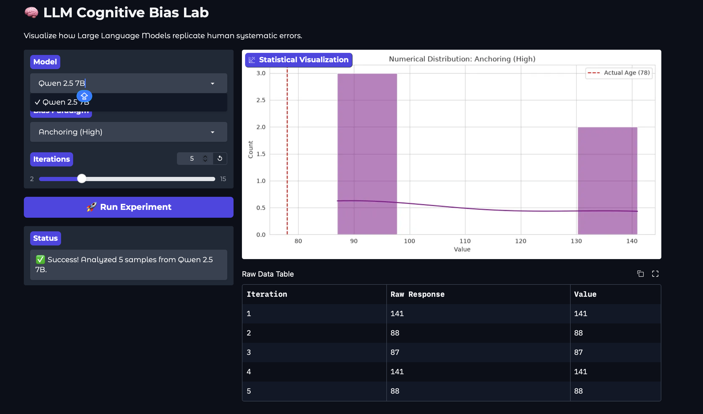

<div align="center">

# llm-cognitive-biases 🧠

### Replicating Classical Human Cognitive Biases in Large Language Models

[](LICENSE)


</div>

---

## Overview

Large language models are increasingly used as computational models of human behavior. While most evaluations focus on benchmark accuracy and reasoning capability, considerably less attention has been devoted to whether these systems reproduce the systematic biases documented in human cognition.

This project investigates whether LLMs exhibit the characteristic irrationalities described by the Heuristics and Biases program of Kahneman and Tversky.

---

## Central Question

> To what extent do large language models reproduce the same systematic cognitive biases observed in humans?

---

## Methodology

Unlike conventional benchmarks, this project follows a **direct replication** methodology.

* **Canonical wording**
  Original experimental prompts are reproduced whenever possible.

* **Zero-shot evaluation**
  No fine-tuning or task-specific optimization.

* **Distributional analysis**
  Models are sampled repeatedly (N > 10) to estimate response distributions and effect sizes.

* **Human baselines**
  Published findings from cognitive psychology serve as reference points.

---

## Experimental Paradigms

| Paradigm               | Description                                            |
| ---------------------- | ------------------------------------------------------ |
| Anchoring              | Influence of arbitrary numerical anchors on estimation |
| Framing Effect         | Preference reversal caused by gain vs. loss wording    |
| Conjunction Fallacy    | The Linda problem                                      |
| Base-Rate Neglect      | Ignoring prior probabilities                           |
| Availability Heuristic | Frequency estimates driven by ease of recall           |

---

## Initial Results

| Bias Type           | Human Baseline       | LLM Observation     |
| ------------------- | -------------------- | ------------------- |
| Anchoring           | Strong anchor effect | Replicated          |
| Conjunction Fallacy | ~85% fallacy rate    | Partial replication |

<div align="center">



**Figure 1. Preliminary anchoring effect observed in Qwen2.5-7B.**

</div>

---

## Models

Current experiments include:

* Qwen2.5-7B-Instruct
* Llama-3.1-8B-Instruct
* Mistral-7B-Instruct

The objective is not to rank models, but to investigate whether human-like biases emerge consistently across architectures.

---

## Technical Stack

### Inference

* Hugging Face Inference API
* Serverless inference

### Models

* Qwen2.5-7B
* Llama-3.1-8B
* Mistral-7B

### Analysis

* Python
* Pandas
* NumPy
* SciPy
* Statsmodels
* Matplotlib
* Seaborn

### Interface

* Gradio
* Hugging Face Spaces

---

## Repository Structure

```text
llm-cognitive-biases/

├── app.py
├── src/
├── prompts/
├── experiments/
│   ├── anchoring/
│   ├── framing/
│   ├── conjunction/
│   ├── base_rate/
│   └── availability/
├── data/
├── analysis/
├── figures/
├── notebooks/
├── paper/
├── requirements.txt
└── README.md
```

---

## Running Locally

Clone the repository

```bash
git clone https://github.com/rahulkiran2222/llm-cognitive-biases.git
cd llm-cognitive-biases
```

Install dependencies

```bash
pip install -r requirements.txt
```

Set your Hugging Face token

```bash
export HF_TOKEN="your_token_here"
```

Launch the application

```bash
python app.py
```

---

## References

* Tversky, A., & Kahneman (1974). *Judgment under Uncertainty: Heuristics and Biases*. Science.
* Tversky, A., & Kahneman (1981). *The Framing of Decisions and the Psychology of Choice*. Science.
* Tversky, A., & Kahneman (1983). *Extensional versus Intuitive Reasoning*. Psychological Review.
* Kahneman, D. (2011). *Thinking, Fast and Slow*.

---

## Citation

```bibtex
@misc{llm_cognitive_biases_2026,
  title={Replicating Classical Human Cognitive Biases in Large Language Models},
  author={Rahul Kiran},
  year={2026}
}
```

---

## Author

**Rahul Kiran**

* GitHub: https://github.com/rahulkiran2222
* Hugging Face: https://huggingface.co/rahulkiran2222
* LinkedIn: https://linkedin.com/rahul-g-kiran

---
